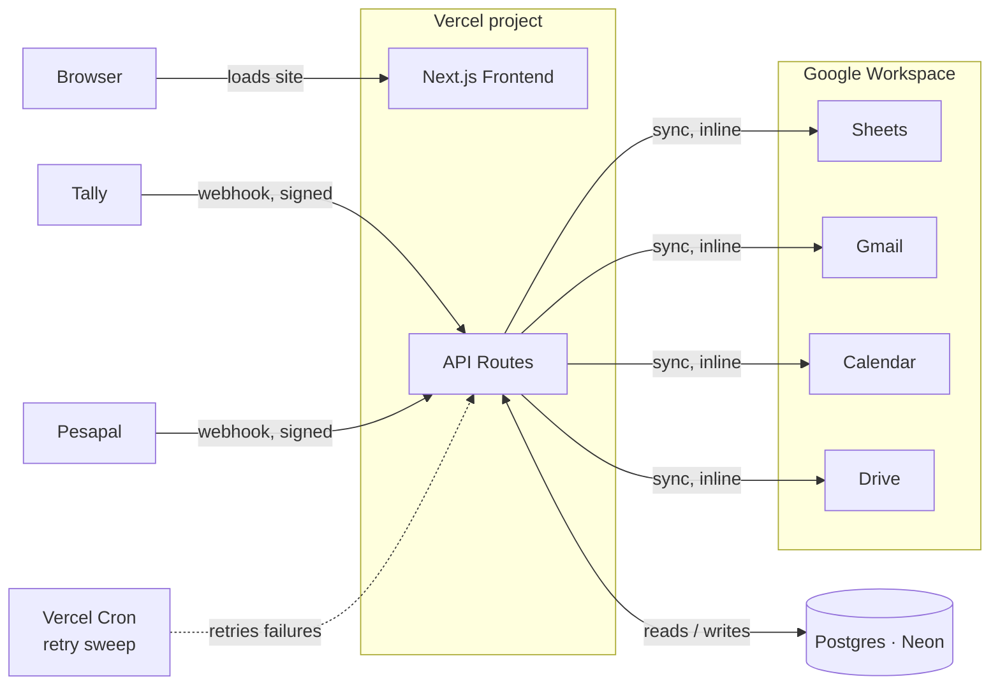
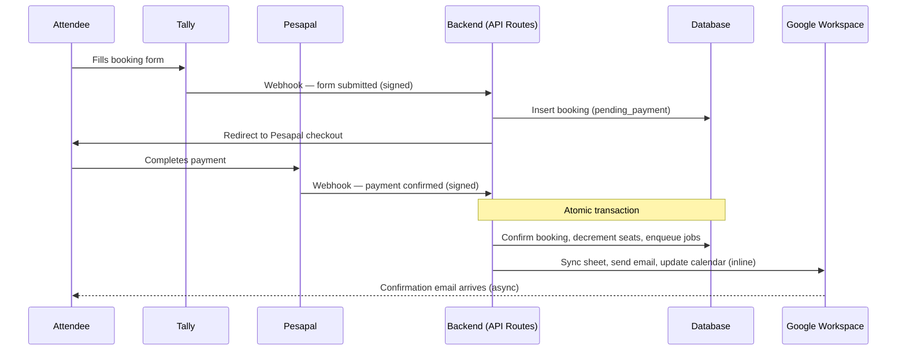

# Ai-Nativ — Backend Architecture

**Status:** Draft for review · v1 scope: Clone Camp booking (Community and Labs lead capture follow the same pattern in v2–v3)
**Stack:** Next.js API Routes (no separate backend service) · Postgres (Neon) + Prisma · Pesapal · Tally · Google Workspace

How bookings, payments, and Google Workspace sync fit together — scoped to running everything inside the existing Next.js project on Vercel, rather than standing up a separate backend service.

## Why no separate backend service

The frontend is already hosted on Vercel. A separate service (e.g. Fastify + Redis/BullMQ) would need its own always-on host, because Vercel's serverless functions can't run a persistent background worker — that would mean paying for and maintaining two hosting platforms for one small event brand. Folding the backend into Next.js API routes keeps everything on one deploy, one domain, one pipeline, while still giving a real Postgres source of truth and signed webhook verification in place of the fragile Google Apps Script glue the owner uses today.

## System map

Two inbound webhooks, one outbound integration. The API layer never calls Tally or Pesapal — it only receives from them. Google Workspace sync runs inline right after a booking is confirmed; Vercel Cron exists only to retry the rare failure, not to drive the common path.

## Critical path — booking a seat

The sequence that actually moves money and fills a cohort. The confirm-and-decrement step is the guarded one: no seat is confirmed until a verified payment says so.

> **Edge case.** If a cohort fills between checkout start and payment confirmation, the second confirmed payment is written as a booking with status `overbooked`, not silently confirmed and not silently dropped. It enqueues a Gmail alert to the owner for manual resolution (extra seat, refund, or move to the next cohort) — a real edge case, handled visibly rather than hidden.

## Data model

Seven tables. `Job` and `WebhookEvent` exist purely for reliability — retrying failed Google calls and auditing every signed payload that ever arrived.

### Cohort
One row per Clone Camp date — the seat cap lives here, not on individual bookings.

| Field | Type |
|---|---|
| `label` | text |
| `event_date` | date |
| `seat_cap` | int (50) |
| `seats_confirmed` | int |

### Booking
One attendee's claim on a seat, from intake through confirmation.

| Field | Type |
|---|---|
| `cohort_id` | fk → Cohort |
| `tally_submission_id` | text, unique |
| `attendee_name` / `attendee_email` / `attendee_phone` | text |
| `status` | enum: `pending_payment` \| `confirmed` \| `overbooked` \| `expired` |

### Payment
The Pesapal side of a booking or membership — raw payload kept for audit.

| Field | Type |
|---|---|
| `booking_id` | fk, nullable |
| `pesapal_tracking_id` | text, unique |
| `amount` / `currency` | numeric / text |
| `status` | enum: `pending` \| `confirmed` \| `failed` |
| `raw_payload` | jsonb |

### CommunityMembership
Ksh 1,000/mo WhatsApp community — separate revenue line from Clone Camp.

| Field | Type |
|---|---|
| `member_name` / `member_email` / `member_phone` | text |
| `tier` | enum: `included_trial` \| `monthly` \| `six_month` \| `annual` |
| `started_at` / `renews_at` | timestamp |
| `status` | enum: `active` \| `lapsed` \| `cancelled` |

### LabsLead
Sales-call-only pipeline — no price is ever shown, so no checkout, just a lead record.

| Field | Type |
|---|---|
| `contact_name` / `contact_email` / `contact_phone` | text |
| `business_summary` | text |
| `status` | enum: `new` \| `contacted` \| `qualified` \| `won` \| `lost` |
| `source` | text |

### Job
Retry queue for the inline Google Workspace calls — only populated on failure.

| Field | Type |
|---|---|
| `type` | enum: `sheets_sync` \| `gmail_send` \| `calendar_update` \| `drive_file` |
| `payload` | jsonb |
| `status` / `attempts` | enum / int |
| `last_error` | text, nullable |

### WebhookEvent
Every raw Tally/Pesapal payload, signed or not — the audit trail if anything is disputed.

| Field | Type |
|---|---|
| `source` | enum: `tally` \| `pesapal` |
| `signature_valid` | bool |
| `payload` | jsonb |
| `received_at` | timestamp |

## Integrations

Three outside systems, three different trust boundaries.

### Tally
Stays exactly as the owner uses it today — the actual form UI. Its webhook is the only thing that changes: it now points at our API instead of Apps Script.

Env: `TALLY_WEBHOOK_SECRET`

### Pesapal
Hosted checkout page for both Clone Camp tickets and Community subscriptions. We never touch card details — only the signed confirmation webhook.

Env: `PESAPAL_CONSUMER_KEY`, `PESAPAL_CONSUMER_SECRET`, `PESAPAL_IPN_ID`

### Google Workspace
One service account with domain-wide delegation, impersonating the owner's account for Sheets, Gmail, Calendar, and Drive — one integration, not four separate OAuth flows.

Env: `GOOGLE_SERVICE_ACCOUNT_JSON`, `GOOGLE_IMPERSONATE_EMAIL`

> **Requires.** Domain-wide delegation can only be granted by a Google Workspace **admin**, not a regular user. Confirm the owner has admin access to the Workspace Admin Console before this integration is built — if not, the fallback is per-account OAuth with a stored refresh token, which works but needs periodic re-auth.

## Security & ops

- **Every webhook is verified before it's trusted** — Tally and Pesapal both sign their payloads; an invalid signature is logged to `WebhookEvent` and dropped, never processed.
- **Idempotency by design** — `tally_submission_id` and `pesapal_tracking_id` are unique constraints, so a retried webhook (both providers retry on timeout) can never create a duplicate booking or double-confirm a payment.
- **Least-privilege service account** — the Google service account is scoped only to Sheets, Gmail send, Calendar, and Drive on the one impersonated account, nothing org-wide.
- **Secrets live in Vercel environment variables**, never in the repo — same pattern the frontend already follows for anything sensitive.
- **No card data ever touches our servers** — Pesapal's hosted checkout handles that; we only ever see a signed confirmation.

## Open decisions

| Status | Decision |
|---|---|
| 🚩 Flagged | **Refund / cancellation policy** is not yet decided. The `status` enum leaves room for a future `refunded` value, but no refund logic or Pesapal refund calls are built in v1. |
| ⏸ Deferred | **Admin dashboard** — the Google Sheet sync serves as the interim view, since that's where the owner already works. A dedicated internal dashboard is a v2+ decision, only if Sheets stops being enough. |
| ✅ Decided | **IntaSend was considered and set aside** in favor of Pesapal for v1. Revisit only if Pesapal's fees or M-Pesa reliability become a problem in practice. |
| 🚩 Confirm | **Vercel plan tier** affects cron cadence (Hobby: once daily, Pro: per-minute). This is why Google sync runs inline rather than depending on cron for the common path — cron is only the retry sweep, so it works on either tier. |
