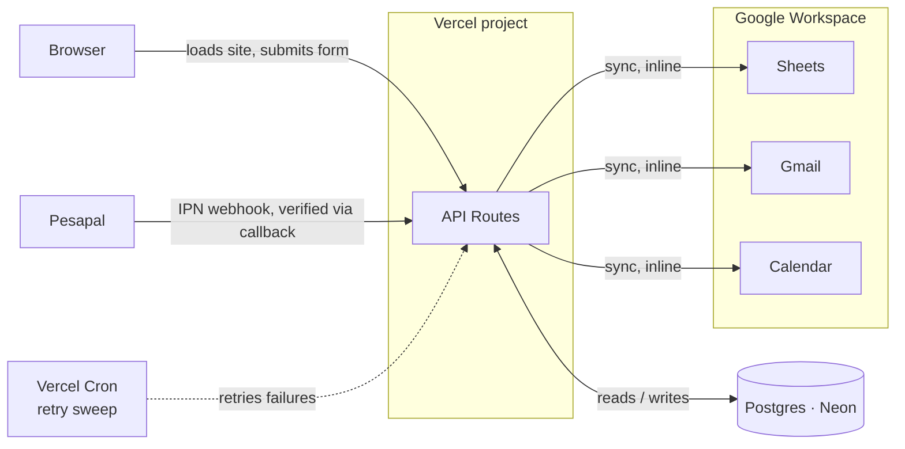
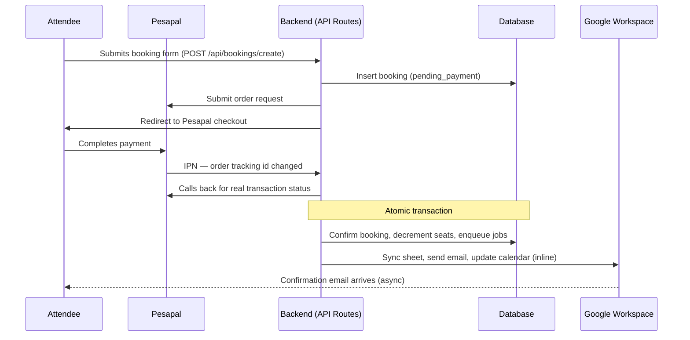

# Ai-Nativ — Backend Architecture

**Status:** Clone Camp booking and Community subscriptions are live. Labs lead capture is the remaining slice.
**Stack:** Next.js API Routes (no separate backend service) · Postgres (Neon) + Prisma · Pesapal · Google Workspace

How bookings, payments, and Google Workspace sync fit together — scoped to running everything inside the existing Next.js project on Vercel, rather than standing up a separate backend service.

## Why no separate backend service

The frontend is already hosted on Vercel. A separate service (e.g. Fastify + Redis/BullMQ) would need its own always-on host, because Vercel's serverless functions can't run a persistent background worker — that would mean paying for and maintaining two hosting platforms for one small event brand. Folding the backend into Next.js API routes keeps everything on one deploy, one domain, one pipeline.

## Why there's no Tally in this anymore

The original plan (see git history) kept Tally as the form UI, with our backend receiving its webhook. In practice that added more complexity than it removed: a separate Tally form per product, no clean way to tell Tally which Community tier a "Select Plan" click meant, a webhook handler that had to *guess* which product a submission belonged to by string-matching the form name, and a checkout route that had to poll and wait for Tally's webhook to land before it could even look up the record it needed.

Both forms now live directly in the Next.js site. The attendee's browser POSTs straight to our own API, which already knows exactly which product and (for Community) which tier — no guessing, no webhook, no polling. Google Workspace sync is unchanged by this; it was never Tally's job.

## System map

One inbound webhook (Pesapal), one outbound integration (Google Workspace). Form submissions aren't a webhook at all — they're a normal request to our own API. Google Workspace sync runs inline right after a payment confirms; Vercel Cron exists only to retry the rare failure, not to drive the common path.

## Critical path — booking a seat

The sequence that actually moves money and fills a cohort. The confirm-and-decrement step is the guarded one: no seat is confirmed until a verified payment says so.

Community subscriptions follow the identical shape (`POST /api/community/create` instead), the only difference being a `tier` field baked into whichever pricing card's form the attendee opened.

> **Edge case.** If a cohort fills between checkout start and payment confirmation, the second confirmed payment is written as a booking with status `overbooked`, not silently confirmed and not silently dropped. It enqueues a Gmail alert to the owner for manual resolution (extra seat, refund, or move to the next cohort) — a real edge case, handled visibly rather than hidden.

> **Pesapal doesn't sign its IPN call.** Trust comes from calling back into Pesapal's own `GetTransactionStatus` API with our credentials, not from anything in the inbound request — this is why the `WebhookEvent` audit table's `verified` column means "the callback succeeded," not "a signature checked out," for Pesapal rows.

## Data model

Six tables live. `LabsLead` is designed but not built yet.

### Cohort
One row per Clone Camp date — the seat cap lives here, not on individual bookings.

| Field | Type |
|---|---|
| `label` | text |
| `event_date` | date |
| `seat_cap` | int (50) |
| `seats_confirmed` | int |
| `calendar_event_id` | text, nullable |

### Booking
One attendee's claim on a seat, from intake through confirmation.

| Field | Type |
|---|---|
| `cohort_id` | fk → Cohort |
| `idempotency_key` | text, unique — generated client-side per form load, guards against a double-click or retried submit creating two bookings |
| `attendee_name` / `attendee_email` / `attendee_phone` | text |
| `status` | enum: `pending_payment` \| `confirmed` \| `overbooked` \| `expired` |

### CommunityMembership
Ksh 1,000/mo (or 6-month / annual) WhatsApp community — separate revenue line from Clone Camp.

| Field | Type |
|---|---|
| `idempotency_key` | text, unique — same purpose as Booking's |
| `member_name` / `member_email` / `member_phone` | text |
| `tier` | enum: `included_trial` \| `monthly` \| `six_month` \| `annual` |
| `started_at` / `renews_at` | timestamp, nullable — `renews_at` is computed from `tier` (1 / 6 / 12 months out), not a flat 30 days regardless of plan |
| `status` | enum: `pending_payment` \| `active` \| `lapsed` \| `cancelled` |

### Payment
The Pesapal side of a booking *or* a membership — exactly one of `booking_id` / `membership_id` is set, never both.

| Field | Type |
|---|---|
| `booking_id` / `membership_id` | fk, nullable, unique each |
| `pesapal_order_tracking_id` | text, unique |
| `amount` / `currency` | numeric / text — the backend's own price lookup, never trusted from client input |
| `status` | enum: `pending` \| `confirmed` \| `failed` |
| `raw_payload` | jsonb |

### LabsLead — not built yet
Sales-call-only pipeline — no price is ever shown, so no checkout, just a lead record. Documented here so the shape is agreed before it's built: `contact_name` / `contact_email` / `contact_phone`, `business_summary`, `status` (`new` → `contacted` → `qualified` → `won`/`lost`), `source`.

### Job
Retry queue for the inline Google Workspace calls — only populated on failure.

| Field | Type |
|---|---|
| `type` | enum: `sheets_sync` \| `gmail_send` \| `calendar_update` |
| `payload` | jsonb |
| `status` / `attempts` | enum / int |
| `last_error` | text, nullable |

### WebhookEvent
Every raw Pesapal IPN call — the audit trail if a payment is ever disputed. (Also holds historical rows from the retired Tally integration; the `tally` enum value stays for that history, nothing new writes it.)

| Field | Type |
|---|---|
| `source` | enum: `tally` (historical) \| `pesapal` |
| `verified` | bool |
| `payload` | jsonb |
| `received_at` | timestamp |

## Integrations

### Pesapal
Hosted checkout page for both Clone Camp tickets and Community subscriptions. We never touch card details — only the signed confirmation webhook.

Env: `PESAPAL_CONSUMER_KEY`, `PESAPAL_CONSUMER_SECRET`, `PESAPAL_IPN_ID`, `PESAPAL_ENV`

### Google Workspace
Env: `GOOGLE_SHEETS_SPREADSHEET_ID`, `GOOGLE_CALENDAR_ID`, `GOOGLE_OAUTH_CLIENT_ID`, `GOOGLE_OAUTH_CLIENT_SECRET`, `GOOGLE_OAUTH_REFRESH_TOKEN`

> **Auth path changed from the original plan.** The plan called for a service account with domain-wide delegation, impersonating the owner's Workspace account — but that requires an active (paid) Google Workspace subscription just to grant the delegation, which wasn't available during testing. The testing-phase auth is plain OAuth2 against a personal Google account's refresh token instead — see `src/features/google-workspace/googleAuth.ts`. **Before handoff to the real owner**, decide whether to switch to domain-wide delegation (needs him to have Workspace admin access) or keep OAuth2 permanently (simpler, but the refresh token belongs to whichever personal account authorized it, and needs periodic re-auth if Google revokes it).

## Security & ops

- **Pesapal's IPN is verified via callback, not signature** — the inbound call isn't trusted on its own; `confirmPaymentFromCallback` always calls back into Pesapal's own status API before acting on it.
- **Idempotency by design** — `idempotency_key` (generated client-side per form load) and `pesapal_order_tracking_id` are unique constraints, so a double-submitted form or a retried Pesapal webhook can never create a duplicate booking/membership or double-confirm a payment. The seat-claim itself is additionally guarded by a conditional atomic UPDATE (not read-then-write), safe under real concurrency — two payments confirming for the last seat at the same instant can't both win.
- **Payment amounts are never trusted from the client** — `COMMUNITY_TIER_PRICING_KES` and the Clone Camp price are backend constants, looked up by tier/product, not read from form input.
- **Secrets live in Vercel environment variables**, never in the repo.
- **No card data ever touches our servers** — Pesapal's hosted checkout handles that; we only ever see a signed confirmation.

## Open decisions

| Status | Decision |
|---|---|
| 🚩 Flagged | **Refund / cancellation policy** is not yet decided. The `status` enums leave room for a future `refunded` value, but no refund logic or Pesapal refund calls are built. |
| 🚩 Flagged | **Real WhatsApp community invite link** is required before a confirmed Community payment's welcome email will actually work — `COMMUNITY_WHATSAPP_INVITE_URL` is deliberately left unset rather than filled with a fabricated link. |
| 🚩 Flagged | **Google auth path** (OAuth2 vs. domain-wide delegation) needs a final call before handoff — see the Integrations section above. |
| ⏸ Deferred | **Admin dashboard** — the Google Sheet sync serves as the interim view, since that's where the owner already works. A dedicated internal dashboard is a later decision, only if Sheets stops being enough. |
| ✅ Decided | **IntaSend was considered and set aside** in favor of Pesapal. Revisit only if Pesapal's fees or M-Pesa reliability become a problem in practice. |
| ✅ Decided | **Tally was removed** in favor of native forms — see "Why there's no Tally in this anymore" above. |
| 🚩 Confirm | **Vercel plan tier** affects cron cadence (Hobby: once daily, Pro: per-minute). This is why Google sync runs inline rather than depending on cron for the common path — cron is only the retry sweep, so it works on either tier. |
